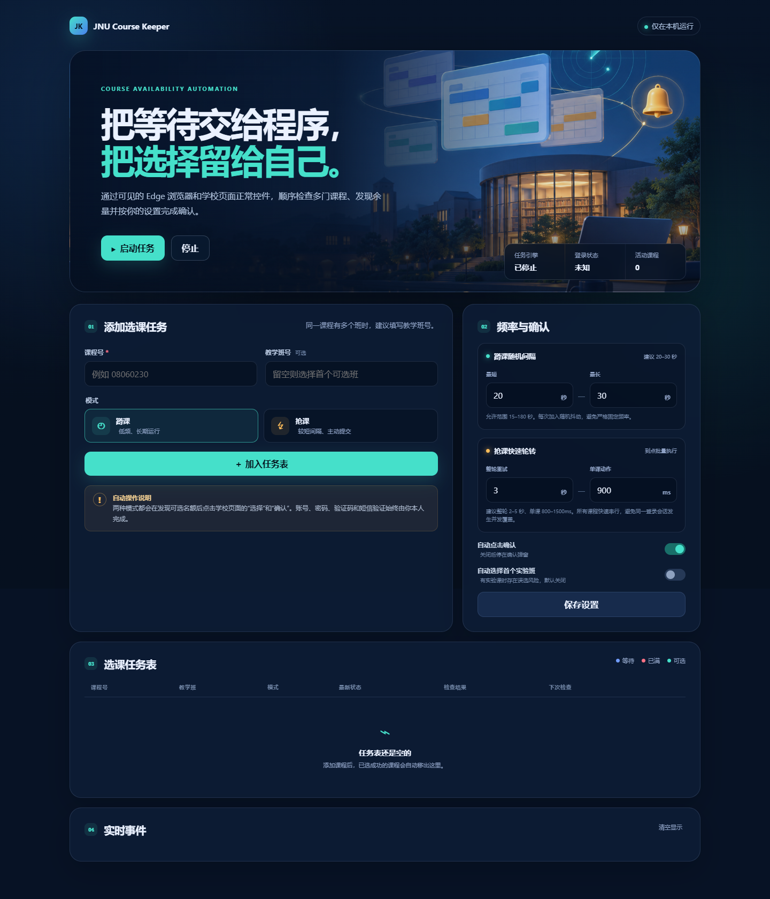

# JNU Course Keeper

一个运行在本机的暨南大学选课辅助工具。它通过**可见的 Microsoft Edge 浏览器**操作学校选课页面，可同时维护多门课程任务，发现可选教学班后通过页面正常按钮完成选择与确认。



> 本项目不是暨南大学官方产品，与暨南大学及选课系统开发方无隶属或合作关系。使用前请确认学校规则允许自动化辅助操作，并自行承担账号、课程冲突和误选风险。

## 功能

- **蹲课**：默认每 20–30 秒随机检查一次，适合连续监控余量。
- **抢课**：为任务设置启动时间；程序提前保持登录，到点后快速轮转所有抢课任务，直到分别成功。
- **多课程任务表**：蹲课与抢课任务可以并存，所有页面操作严格串行。
- **自动移出**：某门课程确认选课成功后，从活动任务表移入成功记录。
- **可见浏览器**：不会在无界面的后台偷偷操作，可随时查看学校页面。
- **登录恢复**：复用独立浏览器 Profile；统一认证失效时等待用户人工登录。
- **本地控制台**：课程、状态、容量、教师、错误和检查时间集中显示。

## 安全边界

项目不会：

- 保存或填写账号、密码；
- 绕过验证码、短信、CAS 或统一认证；
- 构造、保存或复用带 token 的课程 URL；
- 伪造选课请求或直接调用学校内部 POST 接口；
- 并发轰炸学校服务器。

自动选课使用学校页面自己的 `.cv-choice` 和确认按钮。浏览器生成的 Cookie 保存在 `runtime/browser-profile/`，该目录已加入 `.gitignore`，**不要上传或分享**。

## 环境要求

- Windows 10/11
- Node.js 20 或更高版本
- Microsoft Edge（优先）或 Google Chrome
- 能正常访问 `https://jwxk.jnu.edu.cn`

如果 VPN 导致统一认证页面超时，请关闭 VPN，或为 `*.jnu.edu.cn` 配置 DIRECT 规则。

## 安装与运行

```bat
git clone <你的仓库地址>
cd jnu-course-keeper
npm install
npm start
```

浏览器打开：

```text
http://127.0.0.1:3210
```

操作顺序：

1. 在控制台添加课程号；如已确定具体教学班，建议同时填写教学班号。
2. 选择“蹲课”或“抢课”。
3. 检查频率与确认设置，点击“保存设置”。
4. 点击“启动任务”。
5. 在打开的 Edge 中人工完成首次登录、验证码或短信验证。
6. 保持控制台和 Edge 运行。选课成功的课程会自动移出活动任务表。

按 `Ctrl+C` 可停止本地服务和自动化浏览器。

## 两种模式与频率

### 蹲课

- 默认：20–30 秒随机间隔
- 建议：20–60 秒
- 程序允许：15–180 秒

### 抢课

每条抢课任务必须设置启动时间。建议提前 2–5 分钟点击“启动任务”，完成统一认证并让浏览器保持打开。到点前任务显示“等待开抢”，到点后所有抢课课程优先进入快速轮转：

- 整轮重试默认 3 秒，建议 2–5 秒，允许 2–15 秒；
- 相邻单课动作默认 900ms，建议 800–1500ms，允许 500–3000ms；
- 被踢回入口后自动尝试登录和“开始选课”，恢复后未成功课程继续；
- 每门课成功后立即移出活动任务表，其他课程继续抢。

程序只使用一个浏览器实例，并快速**串行**操作所有到点课程，不并发复用同一登录 session。课程越多，一整轮的实际耗时会相应增加。

不建议长期使用 500ms 下限。过高频率可能触发限流、影响其他用户，或违反学校规定。

## 多教学班处理

- 填写教学班号：只尝试该教学班。
- 不填写教学班号：匹配该课程号下所有结果，按页面顺序选择第一个可选教学班。
- 包含实验教学班：默认暂停并提示人工处理。只有明确开启“自动选择首个实验班”时，程序才会选择第一个可用实验班。

## 当前页面适配

目前根据暨南大学选课页面的实际 DOM 适配：

- 全校课程标签：`#aSplitSchoolCourse`
- 搜索框：`#splitSchoolSearch`
- 搜索按钮：`#splitSearchBtn`
- 课程列表：`#splitSchoolBody`
- 选择入口：`.cv-choice`
- 确认弹窗：`#cvDialog .cv-sure`

学校升级页面后，这些结构可能变化。若界面持续显示“未找到”或“无法进入全校课程页面”，请停止任务并提交脱敏后的控制台日志或 DOM 结构，不要提交 Cookie、token、学号和密码。

## 数据目录

运行时数据均位于 `runtime/`：

- `runtime/state.json`：本地任务和设置；
- `runtime/browser-profile/`：浏览器登录状态。

两者都不会被 Git 跟踪。若要清除登录状态，请先停止程序，再自行备份并删除 `runtime/browser-profile/`。

## 项目结构

```text
jnu-course-keeper/
├─ public/                 # 本地 Web 控制台
│  ├─ assets/
│  ├─ app.js
│  ├─ index.html
│  └─ style.css
├─ src/
│  ├─ course-agent.js      # Playwright 页面流程与任务调度
│  ├─ server.js            # 本地 API 与 SSE
│  └─ store.js             # 本地状态持久化
├─ .gitignore
├─ LICENSE
├─ package.json
└─ README.md
```

## 免责声明

本项目仅用于个人学习和辅助操作，不保证选课成功。使用者应核对课程号、教学班、教师、时间冲突、教材和实验班信息。请勿通过修改代码绕过频率限制、身份认证或学校访问控制。

## License

[MIT](LICENSE)
